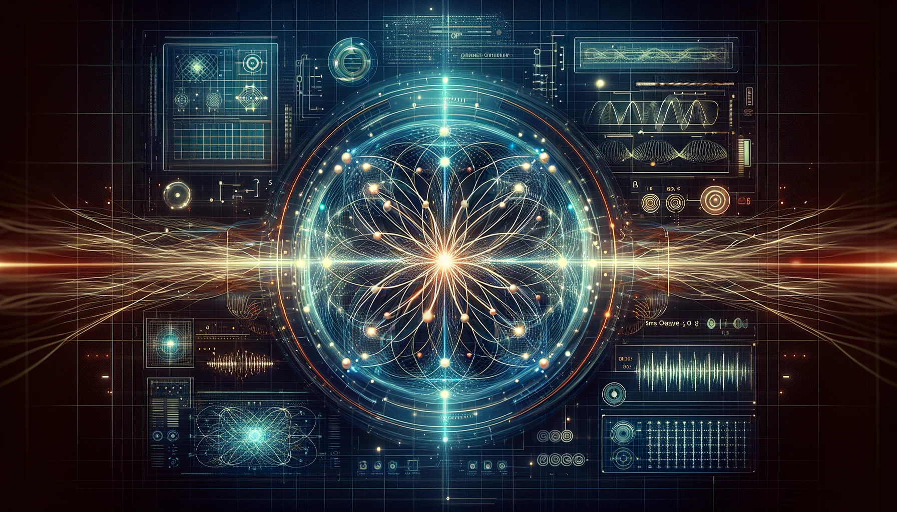

# Quantum Computing

### Introduction to Quantum Computing

Quantum Computing is a field of computing focused on developing computer technology based on the principles of quantum theory, which explains the behavior of energy and material on the atomic and subatomic levels.

### Basic Quantum Mechanics

Basic Quantum Mechanics provides the fundamental principles that underlie quantum computing, including concepts like wave-particle duality, superposition, and entanglement.

### Quantum States and Qubits

Quantum States and Qubits are the basic units of quantum information. Qubits, unlike classical bits, can exist in multiple states simultaneously due to superposition.

### Quantum Entanglement

Quantum Entanglement is a phenomenon where quantum states of two or more objects are interconnected such that the state of one object can instantly influence the state of another, regardless of distance.

### Quantum Superposition

Quantum Superposition refers to a quantum system's ability to be in multiple states at once until it is measured, a fundamental principle enabling the power of quantum computers.

### Introduction to Quantum Algorithms

Introduction to Quantum Algorithms covers the basics of algorithms designed for quantum computers, highlighting how they differ from classical algorithms in terms of complexity and performance.

### Shor's Algorithm

Shor's Algorithm is a quantum algorithm for integer factorization, which efficiently solves a problem that is intractable for classical computers. It has significant implications for cryptography.

### Grover's Algorithm

Grover's Algorithm is a quantum algorithm that provides a quadratic speedup for unstructured search problems. It is one of the most well-known quantum algorithms.

### Quantum Fourier Transform

Quantum Fourier Transform is a linear transformation on quantum bits and is the quantum analogue of the discrete Fourier transform. It is a key component in many quantum algorithms.

### Quantum Simulation

Quantum Simulation uses quantum computers to simulate quantum systems, which is expected to provide insights into complex quantum phenomena and advance fields like materials science and chemistry.

### Quantum Machine Learning

Quantum Machine Learning combines quantum computing with machine learning algorithms to potentially achieve significant speedups and improvements in performance over classical methods.

### Quantum Annealing

Quantum Annealing is a metaheuristic for solving optimization problems using quantum mechanics. It is used by quantum annealers like D-Wave to find the global minimum of a function.

### Variational Quantum Eigensolver

Variational Quantum Eigensolver (VQE) is a hybrid quantum-classical algorithm used to find the ground state energy of a quantum system. It is particularly useful in quantum chemistry and materials science.

### Quantum Approximate Optimization Algorithm (QAOA)

Quantum Approximate Optimization Algorithm (QAOA) is designed to solve combinatorial optimization problems. It uses a parameterized quantum circuit and classical optimization techniques to find approximate solutions.

### Quantum Phase Estimation

Quantum Phase Estimation is a fundamental algorithm used to estimate the phase (or eigenvalue) of an eigenvector of a unitary operator. It is a key component in many quantum algorithms, including Shor's algorithm.

### Amplitude Amplification

Amplitude Amplification is a generalization of Grover's algorithm that increases the probability amplitude of desired outcomes. It is used to boost the success probability of various quantum algorithms.

### Quantum Walks

Quantum Walks are the quantum analog of classical random walks. They have applications in quantum search algorithms, graph algorithms, and other areas of quantum computation.

### Quantum Neural Networks

Quantum Neural Networks (QNN) are quantum versions of classical neural networks. They leverage quantum computing to enhance learning algorithms and are expected to provide exponential speedups in certain tasks.

### Quantum Support Vector Machines

Quantum Support Vector Machines (QSVM) are the quantum counterparts of classical support vector machines. They use quantum computation to enhance classification tasks and can potentially solve problems more efficiently.

### Quantum Generative Adversarial Networks

Quantum Generative Adversarial Networks (QGAN) are quantum versions of generative adversarial networks. They use quantum mechanics to improve the training and generation of data distributions.

### Quantum Boltzmann Machines

Quantum Boltzmann Machines are quantum versions of classical Boltzmann machines used for machine learning. They leverage quantum properties to potentially speed up the learning process and handle larger datasets.

### Quantum Clustering Algorithms

Quantum Clustering Algorithms use quantum computation to perform clustering tasks in machine learning. They aim to provide more efficient and accurate clustering of large datasets.

### Quantum Principal Component Analysis

Quantum Principal Component Analysis (QPCA) is a quantum algorithm that performs principal component analysis on quantum data. It is used to reduce the dimensionality of data and identify important features.

### Quantum Gate Model

Quantum Gate Model is the standard model for quantum computation, where computation is performed using a sequence of quantum gates, which are reversible transformations on qubits.

### Quantum Circuit Model

Quantum Circuit Model represents quantum computations using quantum circuits, which consist of qubits and quantum gates. It is a widely used framework for designing and analyzing quantum algorithms.

### Adiabatic Quantum Computing

Adiabatic Quantum Computing relies on the adiabatic theorem, which ensures that a quantum system remains in its ground state as its Hamiltonian is slowly varied. It is used for solving optimization problems.

### Topological Quantum Computing

Topological Quantum Computing uses anyons and topological states of matter to perform quantum computations. It is robust against local errors and is a promising approach for fault-tolerant quantum computing.

### Quantum Information Theory

Quantum Information Theory studies the storage, transmission, and manipulation of information using quantum systems. It includes concepts like quantum entropy, quantum channels, and quantum error correction.

### Quantum Cryptography

Quantum Cryptography uses the principles of quantum mechanics to develop cryptographic protocols that are theoretically secure against any computational attack, such as quantum key distribution (QKD).

### Quantum Error Correction

Quantum Error Correction involves methods to protect quantum information against errors due to decoherence and other quantum noise. It is essential for building reliable quantum computers.

### Quantum Entropy

Quantum Entropy quantifies the uncertainty or randomness of a quantum state. It is a key concept in quantum information theory and has applications in quantum thermodynamics and quantum communications.

### Quantum Computing Applications

Quantum Computing Applications cover a range of fields where quantum computers are expected to have a significant impact, including cryptography, materials science, pharmaceuticals, and complex system simulations.

### Quantum Communication

Quantum Communication uses quantum mechanics to securely transmit information. It includes technologies like quantum key distribution (QKD) and quantum teleportation.

### Quantum Sensing

Quantum Sensing uses quantum phenomena to measure physical quantities with high precision. Applications include atomic clocks, magnetometers, and gravitational wave detectors.

### Quantum Metrology

Quantum Metrology applies quantum theory to improve the accuracy of measurements. It leverages quantum entanglement and other phenomena to enhance the precision of sensors and measurement devices.

### Quantum Programming Languages

Quantum Programming Languages are designed for expressing quantum algorithms and controlling quantum computers. Examples include Qiskit, Cirq, and Quipper.

### Quantum Software Frameworks

Quantum Software Frameworks provide tools and libraries for developing and testing quantum algorithms. They include platforms like IBM Q Experience, Microsoft Q#, and Google's Cirq.

### Quantum Simulators

Quantum Simulators are classical systems designed to simulate quantum phenomena. They are used to test and develop quantum algorithms and to study quantum systems that are difficult to investigate experimentally.

### Quantum Cloud Computing

Quantum Cloud Computing provides access to quantum processors over the internet, allowing researchers and developers to run quantum algorithms on real quantum hardware remotely.

### Quantum Development Kits

Quantum Development Kits are collections of tools and resources for developing quantum software. They include quantum programming languages, simulators, and libraries for building and testing quantum applications.
